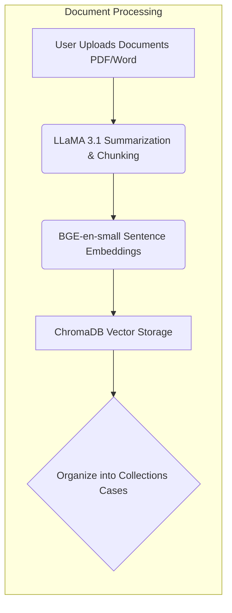

# Rachel.ai


Your AI Paralegal Assistant ,
Revolutionize your legal operations with our open-source AI 
assistant. Ingest, summarize, question, and analyze thousands of case 
files with ease.

## Setup Process

1. **Install Dependencies**

   Install the required packages by running:

   ```bash
   pip install -r requirements.txt
   ```

2. **Backend Setup**

   The backend is organized into two subfolders: `Gradio` and `Fastapi`.

   - **Gradio Folder**

     The main server logic resides in the `Gradio` folder. To start the Gradio server, navigate to the `Gradio` folder and run:

     ```bash
     python3 app.py
     ```

   - **FastAPI Folder**

     After starting the Gradio server, head to the `Fastapi` folder. Here, you will start the FastAPI server which provides REST API routes to interact with the Gradio interface. Run the following command:

     ```bash
     uvicorn main:app --reload
     ```

3. **Frontend Integration**

   With both servers running, you can now build a frontend to interact with the HTTP routes provided by the FastAPI server.

## Future Work

- Add a frontend template.
- Implement the option to perform Q&A on specific documents.

## Hosted Demo

You can try out a hosted demo at [rachelai.vercel.app](http://rachelai.vercel.app).

## Contributions

Contributions are welcome! Feel free to submit issues or pull requests.
